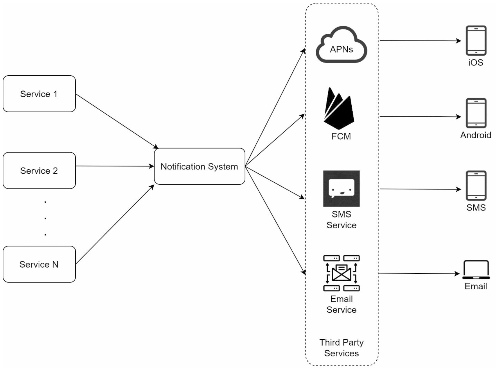
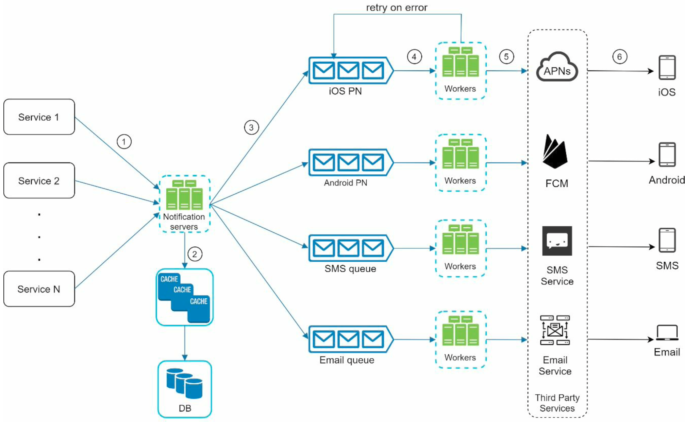

# Chapter 10: design a notification system

A notification is more than just mobile push notifications. Three types of notifications formars are: mobile push notification, SMS, and email.

## Understand the problem and establish design scope

- What type of notifications will be supported?
- Is it a real time system?
- What are the supported devices?
- What triggers the notifications?
- Will users be able to opt-out?
- How many notifications are sent out each day?

## High-level design and get buy-in

### Different types of notifications

The provider builds and sends the notification to a service, which will send the notification to the device. Depending on the type of notification is the service that is used:

- For iOS push notification, Apple Push Notification Service (APNS) is used
- For Android push notification, Firebase Cloud Messaging (FCM) is used
- For SMS messages, services like Twilio, Nexmo and others can be used
- For emails, email services like Sendgrid, Mailchimp and other can be used

### Contact info gathering flow

To send notifications, we need to gather:

- Mobile device tokens, for push notifications
- Phone numbers, for SMS notifications
- Email addresses, for email notifications

When the user installs our app or signs up for the first time, API servers collect user contact info and store in the DB.

The same user can have several devices and then it will be required to send the notifications to all of them.

### Notification sendint/receiving flow

A first approach:

Drawbacks:

- Single Point Of Failuer (SPOF), since there is only one notification system.
- Hard to scale: the notification system handles everything related to push notifications in one server.
- Performance bottleneck: processing and sending notifications can be resource intensive.

Taking into account the previous points, we can change the design to:

Let's describe each element in the design:

- **Service 1 to N**. Services that send notifications trough APIs provided by the notification server.
- **Notifications servers**. They provide the following:
   - APIs to send notifications
   - Basic validations for email, phone numbers, etc
   - Query the DB or cache to fetch data needed to render a notification
   - Put notifications data to message quues for parallel processing

