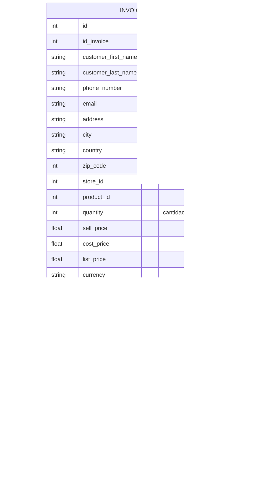
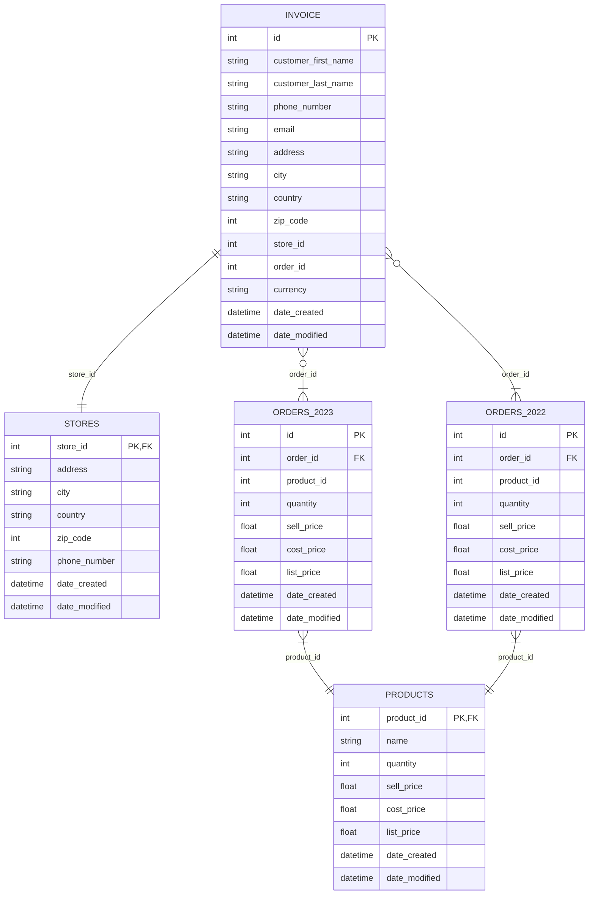

# Particionado(Partitioning) y Fragmentación(Sharding)

La partición es una técnica para dividir grandes bases de datos o tablas en partes más pequeñas, dicho de otra manera es una técnica para distribuir datos en multiples tablas, discos, servidores, etc.

Si decidiéramos partir una tabla en 4 partes tendríamos un diagrama como el siguiente donde cada partición contiene una parte de la información.

Un ejemplo practico es considerar la información en las facturas de los clientes.

Una tabla con toda la información de la orden, implica tener multiples entradas para la misma factura, y se acostumbra agregar un identificador extra para tener todos los elementos de esa factura, lo cual puede resultar en consultadas muy pesadas.

Una partición sencilla de la tabla es agregar una tabla de ordenes `ORDERS_<YEAR>` que contengan la lista de productos asociados a las facturas del año `<YEAR>`.

La partición es un enfoque similar al sharding, pero generalmente se asocia con bases de datos más tradicionales y centralizadas. En lugar de dividir la base de datos en múltiples shards separados, la partición divide lógicamente una tabla en múltiples fragmentos o particiones dentro del mismo servidor. Cada partición contiene un subconjunto de filas o registros, y se define según un criterio específico. 

Tenemos dos tipos de particionado:
- El Particionado Vertical: Los datos son divididos en multiples servidores basándonos en características, sin embargo, una misma tabla se mantiene en el mismo servidor.
- El Particionado Horizontal: Aquí la estrategia es que una misma tabla puede encontrarse divida en muchos servidores, también llamadas fragmentos de datos(data sharding).

## Particionado Vertical

Este tipo de particionado puede ser implementado usando la divisiones lógicas y basadas en niveles de la aplicación.
- Por ejemplo un servidor que contiene toda la información de los usuarios, y otro que se encarga de todos los comentarios hechos en una aplicación.
- Dividir la tabla en sus distintas columnas y que cada servidor guarde un subconjunto de columnas.

# Sharding

Un [shard](https://en.wikipedia.org/wiki/Shard_(database_architecture)) de una base de datos es una partición horizontal de datos en una base de datos o motor de búsqueda. Cada fragmento se mantiene en una instancia de servidor de base de datos separada, para distribuir la carga.

Algunos datos dentro de una base de datos permanecen presentes en todos los fragmentos, pero algunos aparecen solo en un único fragmento. Cada fragmento (o servidor) actúa como fuente única para este subconjunto de datos.

En el contexto de las bases de datos, tanto el sharding (fragmentación) como la partición se refieren a técnicas utilizadas para dividir y distribuir los datos en múltiples nodos o servidores. Aunque a menudo se usan indistintamente, hay diferencias sutiles entre los dos conceptos.

1. Sharding (fragmentación): 
El sharding es una técnica en la que se divide horizontalmente una base de datos en múltiples fragmentos o "shards". Cada shard contiene una parte del conjunto total de datos y se almacena en un nodo o servidor separado. Cada nodo de shard puede ser independiente y administrar su propia porción de datos, lo que permite una distribución equitativa de la carga de trabajo y un acceso más rápido a los datos. En el sharding, generalmente hay una clave o criterio de fragmentación que se utiliza para determinar qué datos se almacenan en cada shard. Por ejemplo, los datos podrían fragmentarse por rango de valores de una columna o mediante algún algoritmo de hash.

# Replicación

La replicación es una técnica en la que se crean y mantienen copias idénticas de la base de datos o partes de ella en múltiples nodos o servidores. La replicación se utiliza para mejorar la disponibilidad y la redundancia de los datos, permitiendo que los servidores secundarios actúen como copias de respaldo o servidores de solo lectura. Los cambios realizados en el servidor principal (también conocido como nodo maestro) se propagan a los servidores secundarios (nodos esclavos) para mantener los datos sincronizados. Si el nodo maestro falla, uno de los nodos esclavos puede asumir el rol de maestro para garantizar la continuidad del servicio. La replicación se centra en la redundancia de datos y la alta disponibilidad.

