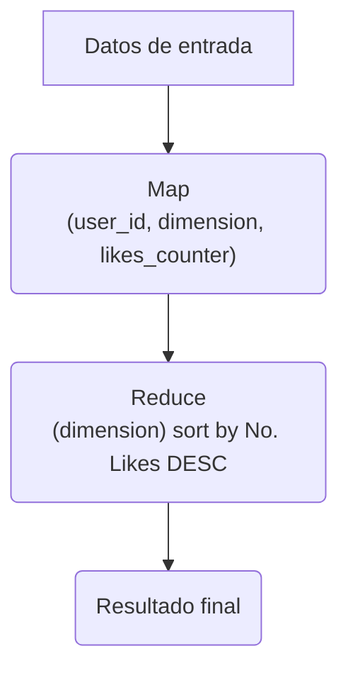
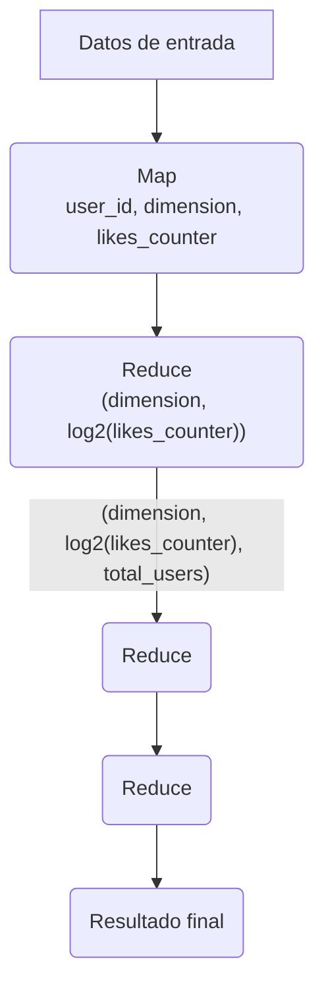

# Solución

Feature Leader indica crear un herramienta que permita a los usuarios ver como están rankeados.

El problema consiste en diseñar un backend que calcule el rank del usuario.

## Sistema Offline

La primer solución es simplemente considerar un `sistema offline`, haciendo un `map reduce`.

Considerando los siguientes límites/cardinalidades (dimensiones) : 

| Dimension | Cardinalidad | Número de valores a los que puede pertenecer cada usuario |
| --------- | ------------ | ---------------------------------------------------------- |
| Categorias | 10,000 | 10 |
| Areas Metropolitanas | 10,000 | 1 |
| Buckets de edad | 6 | 1 |

Es decir, cada usuario puede estar en  hasta 10 categorias de 10K posibles. El usuario solo puede
pertenecer a un area metropolitana de 10K posibles, y consideraremos 6 buckets de edades, 

| id bucket | rango |
| --------- | ----- |
| B1 | 0-9 |
| B2 | 10-19 |
| B3 | 20-29 |
| B4 | 30-39 |
| B5 | 40-49 |
| B6 | >=50 |

- Map Stage: Emitimos tuplas `(user_id, dimension, likes_counter)`
Para dimension de categorias, el contador de likes es el número de likes por categoria.
- Reduce Stage: Agrupamos por dimensión (Group by dimension) y ordenados por numero de likes en orden descendente. Y entonces calculamos la posición(rank). La salida del Reduce stage es una tupla`(user_id, dimension, rank)`

El primer problema a notar es que este map reduce puede tomar mucho tiempo si hay muchos usuarios en la dimension a calcular, por ejemplo, habra muchos usuarios en cada bucket edad(dimensión), ya que solo tenemos 6 buckets.

Para mejorar el rendimiento del reducer(Reduce Stage) debemos asegurarnos que cada reducer no tenga demasiadas llaves ( ver ejemplo con demasiadas llaves), donde una posible solución es distribuir la carga entre los reducers de la siguiente manera:

- **Map Stage**: Emitiremos/crearemos tuplas `(user_id, dimension, likes_counter, log2(likes_counter))`. Aquí `log2(likes_counter)` es truncado utilizando la función floor.
- **Reducers**:
    - **Reduce Stage 1**: Agrupamos por `(dimension, log2(likes_counter))`, contamos cuantos usuarios estan en ese particular bucket `log2(likes_counter)`. La salida de este reducer es: `(dimension, log2(likes_counter), total_users)`
    - **Reduce Stage 2**: Combinamos todas las salidas del Reduce Stage 1 y creamos una nueva salida considerando el mapeo `F: log2(likes_counter) --> total_users`.
    - **Reduce Stage 3**: Del mapa original, 
        - agrupamos por `(dimension, log2(likes_counter))`. 
        - Calculamos la posición(rank) de cada usuario dentro del bucket `log2(likes_counter)` digamos `pos_user_bucket`.
        - Ahora sumamos $N_{log_{2}}$ a la posición(rank) del usuario `pos_user_in_bucket`,  donde $N_{log_{2}}$ es el número `total_users` en el bucket `log2(likes_counter)`  para todos los buckets que tienen valor mayor que `log2(likes_counter)`. $rank=pos\_user\_in\_bucket+\sum_{log2(B)> log_{2}(likes\_counter)} N_{log_{2}(B)}$ Aqui la salida es el reduce stage `(user_id, dimension, rank)`

## Sistema Online

Para actualizar el sistema en tiempo real tenemos algunos tradeoff que considerar entre exactitud y eficiencia computacional.

- Opción 1. 
    - Para cada dimensión mantendremos monitoreo de los primeros K usuarios(Top K) en esa dimensión, donde K puede un número tan grande como 10,000, aunque lo podemos crear en función de las combinaciones de dimensiones y RAM disponible para está tarea. Para los Top K usuarios, cada vez que reciben un like, actualizadmos el número de `likes_counter`. Si el rank de este usuario se mueve con esta actualización actualizamos el rank del usuario y de todos los que serían desplazados. Además es posible trackear usuarios susceptibles a recibir grandes cantidades de likes en cortos periodos de tiempo. Para disminuir el overhead I/O podemos mantenerlos en una memoria cache y hacer flush de estas actualizaciones periodicamente.
    - Para la actualización de la cola restante de usuarios(usualmente llamada la cola larga o long tail), para cada dimensión creamos una función de mapeo `likes_counter` a `rank`. Para esto crearemos esta función que será ejecutada por un trabajo nocturno, haciendo un map reduce similar al que hicimos en el sistema offline. Solo que en lugar de  la salida `(user_id, dimension, rank)` tendremos `(likes_counter, dimension, rank)`, con esto tenemos la infomración necesaria para el mapeo `likes_counter` a `rank`, si tenemos demasiados valores distintos `likes_counter` entonces usamos `(log2(likes_counter), dimension, rank)` e interpolamos la posición de un usuario entre dos puntos.
- Opción 2. 
    - En lugar de solo mantener los primeros K usuarios, podemos crear particiones en distintos server basadas en el número de likes, y asi monitorear los likes de todos los usuarios. Entonces cuando

| 1,2,3,4,5,6,7,8,9,10| 11,12,...,20| 99,999,990...100,000,000|

## Ejemplo con demasiadas llaves

Supongamos que estamos considerando todos los ususarios en el bucket B6(edad >= 50), y este bucket contiene la mitad de mis usuarios.

| Numero de Usuarios | No. de likes |
|---|---|
| 10 | 1 |
| 10 | 2 |
| ... | ... |
| 10 | 100,000,000 |

Entonces el bucket B6 tiene 1000,000,000.

Si edad >= 50

`usuario_id, edad, likes_counter`

- usuario_id: 123
- edad: 51
- likes_counter: 200

likes_counter(usuario_id = 123) += 1

Usando log2 creamos una nueva partición o buckets

| Numero de Usuarios | No. de likes | `log2(likes_counter)`|
|---|---|---|
| 10 | 1 | 0 |
| 10 | 2 | 1 |
| 10 | 3 | 1 |
| 10 | 4 | 2 |
| 10 | 5 | 2 |
| 10 | 6 | 2 |
| 10 | 7 | 2 |
| 10 | 8 | 3 |
| 10 | 9 | 3 |
| 10 | 10 | 3 |
| ... | ... | ... |
| ... | ... | ... |
| 10 | 100,000,000 | 26|

26 cajistas
