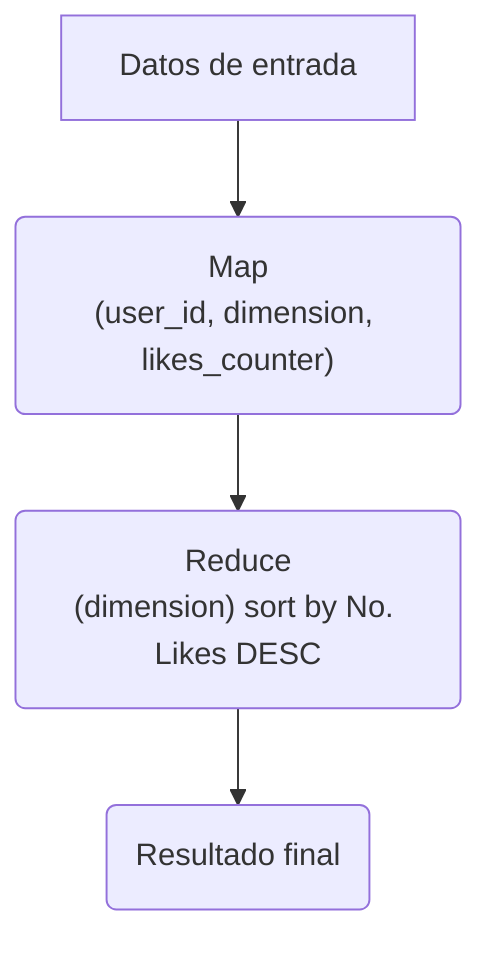
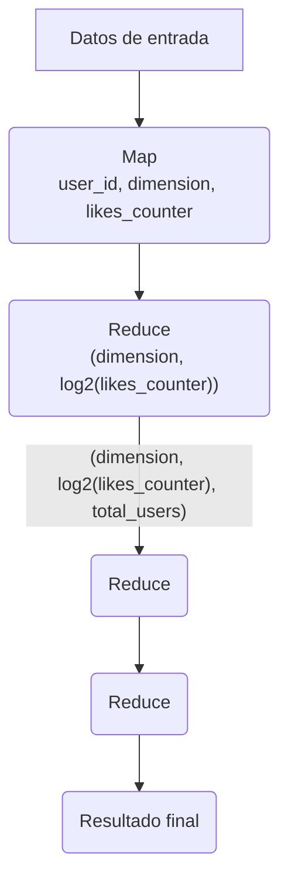

# Solución

Feature Leader indica crear un herramienta que permita a los usuarios ver como están rankeados.

El problema consiste en diseñar un backend que calcule el rank del usuario.

## Solución 1

La primer solución es simplemente considerar un `sistema offline`, haciendo un `map reduce`.

Considerando los siguientes límites/cardinalidades: 

| Dimension | Cardinalidad | Número de valores a los que puede pertenecer cada usuario |
| --------- | ------------ | ---------------------------------------------------------- |
| Categorias | 10,000 | 10 |
| Areas Metropolitanas | 10,000 | 1 |
| Buckets de edad | 6 | 1 |

Es decir, cada usuario puede estar en  hasta 10 categorias de 10K posibles. El usuario solo puede
pertenecer a un area metropolitana de 10K posibles, y consideraremos 6 buckets de edades, 

| id bucket | rango |
| --------- | ----- |
| B1 | 0-9 |
| B2 | 10-19 |
| B3 | 20-29 |
| B4 | 30-39 |
| B5 | 40-49 |
| B6 | >=50 |

- Map Stage: Emitimos tuplas `(user_id, dimension, likes_counter)`
Para dimension de categorias, el contador de likes es el número de likes por categoria.
- Reduce Stage: Agrupamos por dimensión (Group by dimension) y ordenados por numero de likes en orden descendente. Y entoncescalculas el la posición(rank). La salida del Reduce stage es una tupla`(user_id, dimension, rank)`

El primer problema a notar es que este map reduce puede tomar mucho tiempo si hay muchos usuarios en la dimension a calcular, por ejemplo, habra muchos usuarios en la dimensión de edad, ya que solo tenemos 6 buckets.

Para mejorar el rendimiento del reducer(Reduce Stage) debemos asegurarnos que cada reducer no tenga demasiadas llaves, donde una posible solución es distribuir la carga entre los reducers de la siguiente manera:

- **Map Stage**: Emitir tuplas `(user_id, dimension, likes_counter, log2(likes_counter))`. `log2(likes_counter)` es truncado utilizando la función floor.
- **Reduce Stage 1**: Agrupamos por `(dimension, log2(likes_counter))`, contamos cuantos usuarios estan en ese particular bucket `log2(likes_counter)`. La salida de este reducer es: `(dimension, log2(likes_counter), total_users)`
- **Reduce Stage 2**: Combinamos todas las salidas del Reduce Stage 1 y la nueva salida es un solo `F: log2(likes_counter) --> total_users`.
- **Reduce Stage 3**: Del mapa original, agrupamos por `(dimension, log2(likes_counter))`. Calculamos la posición(rank) de cada usuario dentro del bucket `log2(likes_counter)`. Ahora suma X al rank donde X es la suma de `total_users` en `log2(likes_counter)` cuyo valor es mayor que el bucket `log2(likes_counter)`. Aqui la salida es el reduce stage `(user_id, dimension, rank)`

