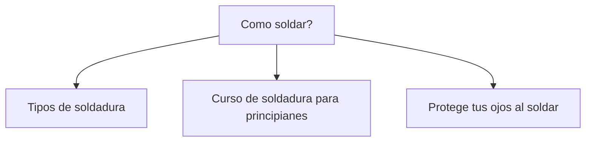
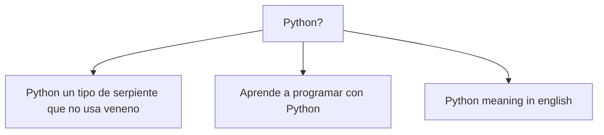

# Solución

# Choosing the proper DB

About the data:
    - Type of data: Structured
    - Data volume: let's assume is up to 1,000,000,000 users
    - Data access patterns: many reads and many writes

My needs:
    - Scalability: horizontal
    - Performance: fast writes and fast reads
    - Availability: it is needed but not critical
    - Consistency: it is more important than availability

DB options: OpenTSBD, Redis, Memcached

Another important point to consider is that we need to do map reduce.

mkdocs server

# Data that will be stored
- Id (integer)
- Name (string, 200 character)
- Current rank (integer)
- Features needed to calculate the current score:
    - Number of likes (integer)
    - Number of shares (integer)
    - ...

# How many users it will support

500 million

Meaning we will need:

500000(4 + 200 + 4 + 4 + 4) = 500000(216) = 108000000 bytes
= 105468.75 kb = 102.99 mb

Meaning we can have all users in memory.

# Solución no en tiempo real

Cada post tendra los siguientes datos:

| Dimension | Cardinalidad | Número de valores a los que puede pertenecer cada usuario |
| --------- | ------------ | ---------------------------------------------------------- |
| Categorias | 10,000 | 10 |
| Areas Metropolitanas | 10,000 | 1 |
| Buckets de edad | 6 | 1 |

Un usuario puede pertenecer a 10 categorias de un total de 10,000, por ejemplo: salud, educacion, musica, etc. El usuario pertenece a un area metropolitana (de un total de 10,000) y su edad estara en un rango 6 posibles.

Ya que se requiere atender aproximadamente a 1,0000,0000,000 usuarios nuestros datasets seran enormes por lo tanto un `mapreduce` enfoque es adecuado para hacer el `ranking`:

1. Los datos de entrada podrian lucir como a continuacion se muestra:

|ID del usuario|Dimension|Numero de likes|
|--|----------|---------------|
|1|Educacion,Ciencia,Matematicas,AM_130,BE_2|
|2|Matematicas,Ciencia, Educacion,AM_130,BE_2|200|
|3|Lenguas,Educacion,Reportaje, AM_130,BE_2|150|
|4|...

Estos datos pueden venir de un sistema de archivos o de una base de datos.

2. El `splitting` se dejara de forma automatica
3. Durante el `mapping` pares del tipo `key-value` seran creados y el `key` puede ser una combinacion entre la categoria y el numero de likes, por ejemplo cada usuario tendriamos algo como:

- (Educacion_10,1), (Ciencia_10,1), (Matematicas_10,1)
- (Matematicas_200,2), (Ciencia_200,2), (Eduacion_200, 2)
- (Lenguas_150,3), (Eduacion_150, 3), (Reportaje_150, 3)
- ...

El `value` en este caso es el id del usuario.

4. En la fase `sorting and shuffling` solo se agruparan todos los pares key-value que tengan el mismo prefijo, en este caso:

- (Educacion_10,1), (Eduacion_150, 3), (Eduacion_200, 2)
- (Ciencia_10,1), (Ciencia_200,2)
- (Lenguas_150,3)
- (Matematicas_10,1), (Matematicas_200,2)
- (Reportaje_150, 3)

5. En la fase `reduce` debemos obtener el `rank`/posicion de cada usuario en cada categoria a la que pertenece:

- Educacion: 2->1, 3->2, 1->3
- Ciencia: 2->1, 1->2
- Lenguas: 3->1
- Matematicas: 2->1, 1->1
- Reportaje: 3->1

En este ejemplo no se abordaron las etiquetas de area metropolitana (AM) y el bucket de edad (BE) pero se puede seguir el mismo enfoque anterior.

Que hacer cuando la carga en un reducer es mucho mayor a la de otros reducers? Una posible solucion es definir un `custom partitioning` funcion que te ayuda a distribuir los records de manera uniforme. Otro enfoque seria identificar el `skew data` para que el key que se le assigne permita una distribucion uniforme.

# Solucion esperando actualizaciones en tiempo real

He estado intentando encontrar una solucion a este problema pero no me es claro.

Estoy viendo algoritmos tipo `learning to rank` que usan `ML` para predecir que resultados podrian ser importantes dado un query/pregunta que el usuario introdujo.

Por ejemplo:

En este ejemplo tenemos un query/pregunta y tres posibles documentos que podrian dar informacion. Sin embargo, algunos documentos deben contener la informacion que requerimos y otros algo menos relevante.

Supongo que podemos algun `Listwise ranking` posiblemente. Estos serian entrenados usando el ranking que obtuvimos en la solucion en tiempo no real.

