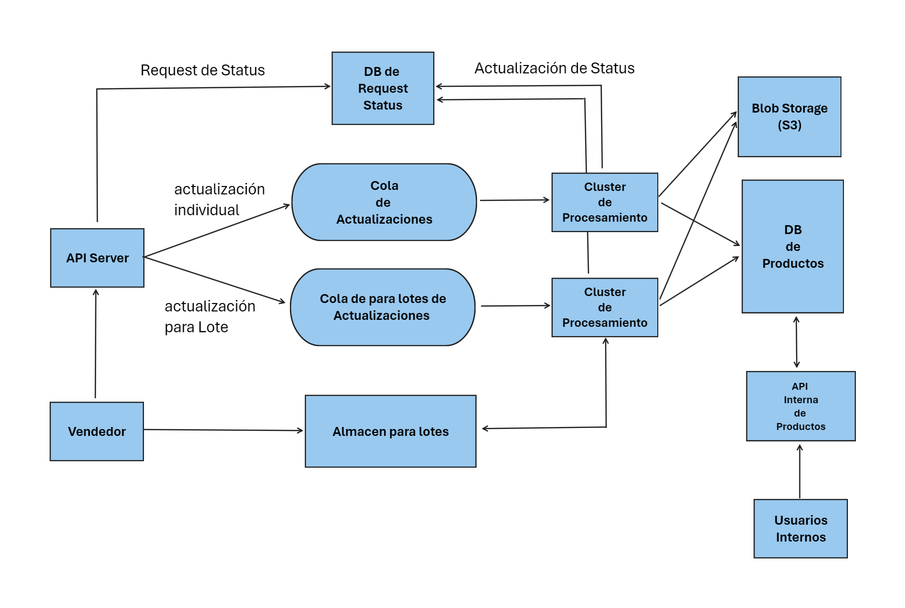

# Solución

Atenderemos principalmente tres tipos de usuarios:

- Vendedores haciendo actualizaciones de un solo producto.
- Vendedores haciendo actualizaciones de productos por lotes.
- Usuarios internos

Respecto a la actualización de productos queremos priorizar:

- la actualización de precios: ayuda a que los vendedores usando la plataforma puedan corregir errores de manera eficas.
- disponibilidad del producto: ayuda a  que los usuarios esten más satisfechos con nuestra plataforma mejorando el "engagement".

Otros atributos como las fotos/imagenes, titulos o descripciones tendrán menos prioridad.

Necesitamos definir:

- Interfaces
- Componentes

## Interfaces

Los vendedores tendrán acceso a dos tipos de API:

1. API para actualizaciones individuales: Está utilizada un típico endpoint REST.
2. API para actualizaciones por lotes (batch)
    - Por el tamaño del catalogo  no es posible ustilizar HTTP para la actualización.
    - Habilitaremos un sistema para subir un archivo las actualizaciones que deberán realizarse, tipicamente con un formato `<date>/<merchant>_<timestamp>.csv`

