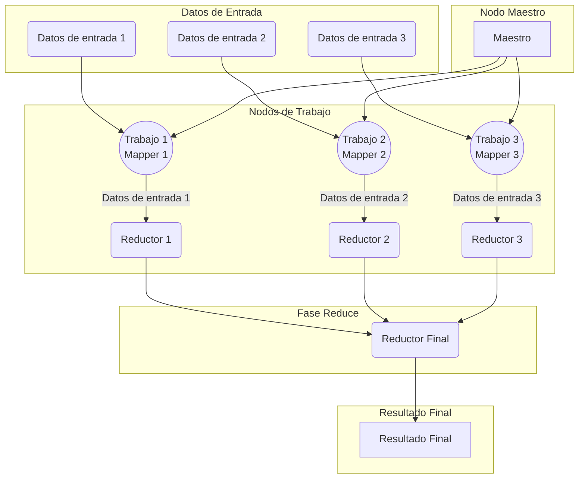

# MapReduce

MapReduce es un modelo de programación y un paradigma de procesamiento de datos diseñado para procesar grandes volúmenes de datos de manera distribuida y paralela en un clúster de computadoras. Fue popularizado por Google y se utiliza ampliamente en sistemas de almacenamiento y procesamiento de datos a gran escala.

El término "MapReduce" hace referencia a dos operaciones fundamentales en el modelo:

1. **Map:** La operación Map toma un conjunto de datos de entrada y los transforma en un conjunto de pares clave-valor. Cada par clave-valor representa un elemento procesado de los datos de entrada. La función Map se aplica de forma independiente a cada fragmento de los datos de entrada en paralelo.

2. **Reduce:** La operación Reduce toma los pares clave-valor producidos por la operación Map y los combina basándose en la clave común. Los pares clave-valor con la misma clave se agrupan juntos y se procesan por separado por la función Reduce. La función Reduce puede realizar operaciones como sumar, contar, filtrar o cualquier otra operación de agregación en los datos agrupados.

En una instancia tenemos:

El flujo de trabajo típico de un sistema MapReduce consta de varias etapas:

- División de los datos de entrada en fragmentos más pequeños llamados "input splits".
- Asignación de estos input splits a los nodos de trabajo disponibles en el clúster.
- Ejecución de la función Map en paralelo en cada nodo de trabajo para procesar los input splits y generar pares clave-valor.
- Mezcla y ordenamiento de los pares clave-valor producidos por la función Map.
- Ejecución de la función Reduce en paralelo en cada nodo de trabajo para procesar los pares clave-valor agrupados y generar el resultado final.
- Recopilación y presentación de los resultados finales.

MapReduce proporciona un modelo simple y escalable para el procesamiento de datos distribuidos, lo que lo hace ideal para aplicaciones que requieren el procesamiento de grandes volúmenes de datos, como la indexación web, el procesamiento de logs, el análisis de datos y más.

Sin embargo en un sistema ddistribuido tenemos algo como lo siguiente:

En este diagrama:

- **Nodo Maestro (MA):** Representa el nodo maestro que coordina todo el proceso de MapReduce.
- **Nodos de Trabajo (WT1, WT2, WT3):** Representan los nodos de trabajo donde se ejecutan los mappers y reducers.
- **Datos de Entrada (DE1, DE2, DE3):** Son los conjuntos de datos de entrada que se dividen y distribuyen entre los nodos de trabajo.
- **Fase Map:** Los datos de entrada se envían a los mappers correspondientes en cada nodo de trabajo para la fase de mapeo.
- **Fase Reduce:** Los datos mapeados se envían a los reducers correspondientes para la fase de reducción. Los resultados parciales se envían al reductor final (RR) para generar el resultado final.
- **Resultado Final (RR):** Es el resultado final de la operación MapReduce.

Este diagrama muestra cómo múltiples entradas de datos se procesan en paralelo utilizando mappers y reducers distribuidos en un sistema MapReduce. Cada nodo de trabajo ejecuta sus propios mappers y reducers, y el nodo maestro coordina todo el proceso.

## Flujo MapReduce

El flujo normal de una operación MapReduce sigue estos pasos:

1. **División de Datos (Input Split):** La operación MapReduce comienza dividiendo los datos de entrada en fragmentos más pequeños llamados "input splits". Cada input split es una porción manejable de los datos que se procesará de forma independiente en un nodo de trabajo.

2. **Asignación de Tareas (Task Assignment):** El coordinador (nodo maestro) asigna estos input splits a los nodos de trabajo disponibles en el clúster. Cada nodo de trabajo ejecutará una o varias instancias de la función Map en los input splits asignados.

3. **Map Phase (Fase Map):** En esta fase, cada nodo de trabajo procesa su input split utilizando la función Map. La función Map toma los datos de entrada y produce un conjunto de pares clave-valor como salida, transformando los datos según sea necesario.

4. **Shuffle and Sort (Mezcla y Ordenamiento):** Después de que todas las instancias de la función Map hayan finalizado, los pares clave-valor resultantes se mezclan y ordenan según la clave común. Esto asegura que todos los valores asociados con una clave específica se agrupen juntos y se envíen al mismo nodo de trabajo para la función Reduce.

5. **Reduce Phase (Fase Reduce):** En esta fase, cada nodo de trabajo procesa los pares clave-valor que recibió después de la fase de shuffle y sort utilizando la función Reduce. La función Reduce puede combinar, resumir o realizar otras operaciones en los datos agrupados por clave.

6. **Output (Salida):** Finalmente, los resultados de las funciones Reduce se combinan para formar la salida final de la operación MapReduce. Dependiendo de la aplicación, esta salida puede ser un conjunto de pares clave-valor, un valor único o una estructura de datos más compleja.

7. **Finalización:** Una vez que todas las tareas de Map y Reduce han finalizado y se ha recopilado la salida final, la operación MapReduce se completa y los recursos se liberan.

Al definir una operación MapReduce, es importante entender varios términos y definiciones clave:

1. **Map Function (Función Map):** Es una función que toma un conjunto de datos como entrada y produce un conjunto de pares clave-valor como salida. Cada par clave-valor representa un elemento transformado de los datos de entrada.

2. **Reduce Function (Función Reduce):** Es una función que toma los pares clave-valor producidos por la función Map y los combina basándose en la clave común. Su salida suele ser otro conjunto de pares clave-valor, pero puede ser un valor único o una estructura de datos más compleja.

3. **Key-Value Pair (Par Clave-Valor):** Es una estructura de datos que consta de dos partes: una clave y un valor asociado. En MapReduce, los datos se manipulan en forma de pares clave-valor.

4. **Input Data (Datos de Entrada):** Son los datos originales que se procesan mediante la operación MapReduce. Estos datos se dividen en fragmentos más pequeños para ser procesados en paralelo.

5. **Output Data (Datos de Salida):** Son los datos resultantes de la operación MapReduce. Pueden ser el resultado final de la operación o datos intermedios generados durante el proceso.

6. **Partitioning (Particionamiento):** Es el proceso de dividir los datos de entrada en fragmentos más pequeños que se procesarán en paralelo en diferentes nodos de un clúster.

7. **Shuffle and Sort (Mezcla y Ordenamiento):** Es la fase en la que los datos de salida del Map se redistribuyen y se agrupan por clave antes de pasarlos a la función Reduce. Esto asegura que todos los valores asociados con una clave específica se envíen al mismo nodo para la función Reduce.

8. **Worker Node (Nodo de Trabajo):** Es un nodo en un clúster que ejecuta la función Map o Reduce. Los datos se procesan de manera distribuida en varios nodos de trabajo para mejorar el rendimiento.

9. **Master Node (Nodo Maestro):** Es un nodo en un clúster que coordina las operaciones MapReduce. Se encarga de asignar tareas a los nodos de trabajo, controlar el flujo de datos y recopilar los resultados finales.

10. **Fault Tolerance (Tolerancia a Fallos):** Es la capacidad del sistema MapReduce para continuar funcionando correctamente incluso si uno o varios nodos de trabajo fallan durante el proceso. Esto se logra mediante la replicación de datos y la reasignación de tareas.

Estos son algunos de los términos y definiciones importantes al definir una operación MapReduce para diseñar y desarrollar sistemas eficientes de procesamiento de datos distribuidos.

