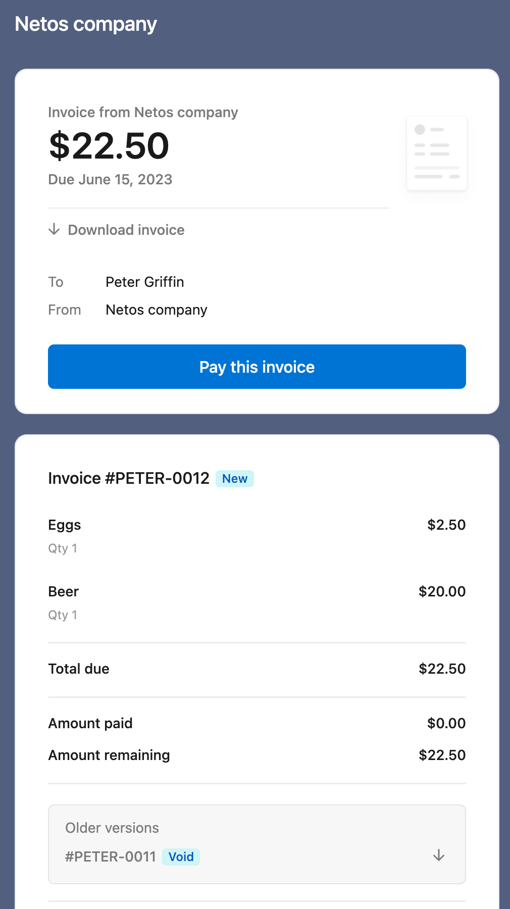

# Como hacer un pago en stripe?

Stripe permite los siguientes tipos de pagos:

- Factura (invoice): Pago unico de un cliente
- Link de pago: usado para obtener pagos unicos o recurrentes de cualquiera
- Subscripcion: pago recurrente de un cliente
- Pago manual: introduce los datos de la tarjeta para tu cliente

Para los siguientes ejemplos supongamos que del sitio web de stripe hemos creado algunos clientes:


Nota the ambos clientes tienen asignadas tarjetas Visa y Mastercard de prueba. Y algunos productos:


## Pago de una factura (invoice)

En el siguiente ejemplo encontraras como crear un invoice a usando las APIs de stripe.

```go
package main

import (
	"fmt"
	"math/rand"
	"os"

	"github.com/stripe/stripe-go/v74"
	"github.com/stripe/stripe-go/v74/customer"
	"github.com/stripe/stripe-go/v74/invoice"
	"github.com/stripe/stripe-go/v74/invoiceitem"
	"github.com/stripe/stripe-go/v74/price"
	"github.com/stripe/stripe-go/v74/product"
)

type MyCustomer struct {
    StripeId string
    Email string
}

type MyPrice struct {
    StripeId string
    Tier string
}

func getCustomers(stripeKey string) []stripe.Customer {
    // Set the secret so you can access to your account
	stripe.Key = stripeKey

    // The following API gets you the list of customer defined in your dashboard
	params := &stripe.CustomerListParams{}
	i := customer.List(params)

	customers := []stripe.Customer{}
	for i.Next() {
		c := i.Customer()
		customers = append(customers, *c)
	}
	return customers
}

func getProducts(stripeKey string) []stripe.Product {
    // Set the secret so you can access to your account
	stripe.Key = stripeKey

    // The following API gets you the list of products defined in your dashboard
    params := &stripe.ProductListParams{}
	i := product.List(params)

	products := []stripe.Product{}
	for i.Next() {
		p := i.Product()
		products = append(products, *p)
	}
	return products
}

func createInvoice(stripeKey string, customer stripe.Customer, products []stripe.Product) *stripe.Invoice {
	// Create the invoice
	inParams := &stripe.InvoiceParams{
		Customer: stripe.String(customer.ID),
		CollectionMethod: stripe.String("send_invoice"),
		DaysUntilDue: stripe.Int64(30),
	  }
	in, _ := invoice.New(inParams)

	// Add products to invoice
	for i := 0; i < len(products); i++ {
		itemParams := &stripe.InvoiceItemParams{
			Customer: stripe.String(customer.ID),
			Price: stripe.String(products[i].DefaultPrice.ID),
			Invoice: stripe.String(in.ID),
		}
		invoiceitem.New(itemParams)
	}

	return in
}

func invoiceExample(stripeKey string) {
	// Get list of customer and products
	customers := getCustomers(stripeKey)
	products := getProducts(stripeKey)
	if len(customers) == 0 || len(products) == 0 {
		return
	}

	// Select 2 random products
	invoiceProducts := []stripe.Product{}
	nInProducts := 2
	if nInProducts > len(products) {
		nInProducts = len(products)
	}
	for len(invoiceProducts) < nInProducts {
		randomInt := rand.Intn(len(products))
		p,_ := price.Get(products[randomInt].DefaultPrice.ID, nil)
		if p.Type == stripe.PriceTypeOneTime {
			invoiceProducts = append(invoiceProducts, products[randomInt])
		}
	}

	fmt.Println("Invoice products len = ", len(invoiceProducts))
	fmt.Println(invoiceProducts)

	// Crate an invoice for a random customer
	in := createInvoice(stripeKey, customers[rand.Intn(len(customers))], invoiceProducts)
	
	// Send the invoice. After the send you should be able to see the invoice in the dashboard
    // ready to be paid.
	fmt.Println("email invoice: ", in.Customer.Email)
	params := &stripe.InvoiceSendInvoiceParams{}
    in,_ = invoice.SendInvoice(in.ID, params)
}

func main() {
    // We pass our secret key in the main parameters
	args := os.Args[1:]
	if (len(args) == 0) {
		fmt.Println("Missing stripe key")
		return
	}

	invoiceExample(args[0])
}
```

Puedes correr con:

```bash
go run <filename>.go <secret key>
```

Cada vez que corras el script, se creara un invoice y deberias poder verlo en tu dashboard:


Desafortunadamente Stripe no enviara los emails para transacciones de prueba. En este caso tendremos que ir al dashboard, simular que se hace una modificacion y entonces el mail sera enviado:


Esto causara que la factura original se cancele y una nueva sea creada:


El cliente recibira un mail como el siguiente:



Si damos click en el link "Pay this invoice" nos lleva a la siguiente pagina:


Donde como clientes podemos usar la tarjeta que tenemos asignada en Stripe, los datos para hacer una transferencia o usar Cash App Pay. En este caso usaremos pago con tarjeta. Una vez pagado podemos descargar la factura o nuestro recibo y en nuestro dashboard podremos ver que el invoice ha sido pagado:


