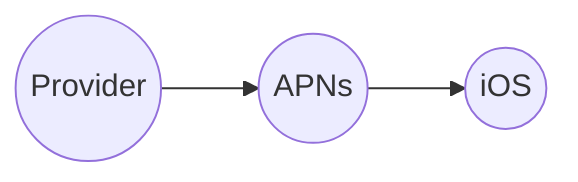
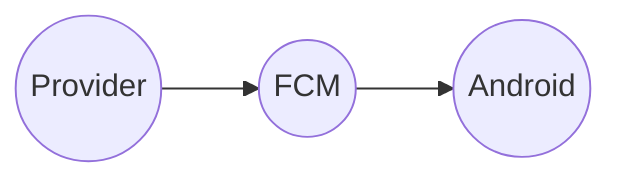
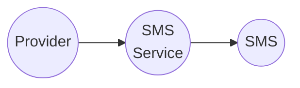
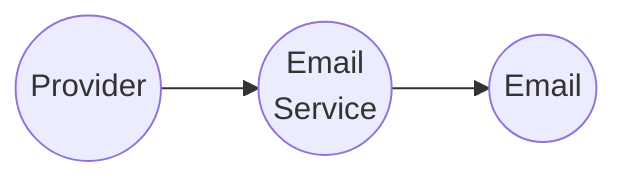
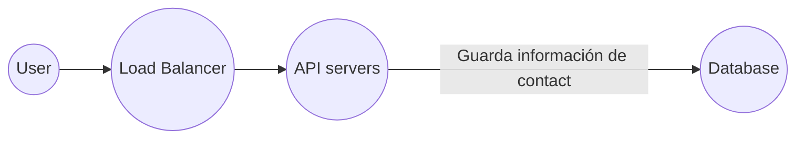

# Sistema de notificaciones (Push Notification System)

Un sistema de notificaciones es una tecnología que permite a las aplicaciones enviar mensajes o alertas directamente a los dispositivos móviles o a las computadoras de los usuarios, incluso cuando la aplicación no está en uso. Estas notificaciones se envían de manera `push`, lo que significa que la información es enviada automáticamente desde el servidor de la aplicación a los dispositivos del usuario, sin que estos tengan que solicitarla activamente.

Las notificaciones push son utilizadas para informar a los usuarios sobre eventos relevantes, actualizaciones de la aplicación, mensajes importantes o cualquier otro tipo de información que la aplicación considere relevante para el usuario. Estas notificaciones pueden incluir texto, imágenes, enlaces y otros elementos multimedia.

Para que las notificaciones push funcionen, los usuarios deben haber otorgado permisos a la aplicación para enviar notificaciones. Este tipo de sistema es comúnmente utilizado en aplicaciones móviles, como redes sociales, aplicaciones de mensajería, noticias y otras, para mantener a los usuarios informados y comprometidos con la aplicación.

Aunque podriamos considerar otros tipos de notificación los siguientes tres tipos de formato en las notificaciones son los más usuales:
- mobile push (iOS, Android)
- SMS
- Email

## iOS push notification

- Provider: Un provider o provedor envia notificaciones a la Apple Push Notification Service (APNS). Para crear una notificación push necesitamos:
    - Device token: El cual es un identificador único.
    - Payload: Un JSON que contiene la notificación.
- APNS: Es un servicio de Apple que nos ayuda a propagar notificaciones a los devices con iOS.
- iOS Device: Es el cliente que recibira la notificación.

## Android push notification

Android tiene un flujo similar al de iOS. En lugar de utilizar APNs, utiliza Firebase Cloud Messaging (FCM).

## SMS

Para el caso de los mensajes SMS, hay servicios third party como Twilio, Nexmo y otros.

## Email

Aunque las compañias puedes setear sus propios servidores para enviar correos, usualmente optan por servicios comerciales como:
- Sendgrid
- Mailchimp

Cuando un usuario se da de alta en una aplicación o instala una aplicación, es cuando debemos guardar en base de datos todos los medios para contactar al usuario.

