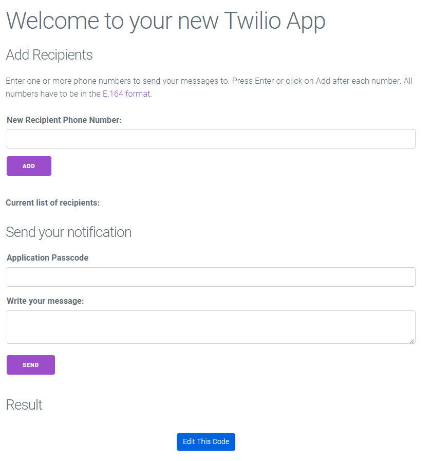

# SMS Notificaciones

## Twilio

Primero deberemos crear una cuenta en twilio

Para comenzar a enviar o recibir mensajes SMS con Twilio, necesitaremos un número de teléfono virtual. 
Twilio nos permite crear un número de teléfono de prueba.
Este número de teléfono de prueba nos permitirá crear prototipos mientras enruta llamadas de voz o mensajes de texto a cualquier teléfono o flujo de trabajo de aplicación.

Los números de teléfono 10DLC admiten SMS bidireccionales para mensajes conversacionales, alertas y notificaciones, y contraseñas de un solo uso (OTP).


```python
from twilio.rest import Client

account_sid = TWILIO_ACCOUNT_SID
auth_token = '[AuthToken]'
client = Client(account_sid, auth_token)

message = client.messages.create(
  from_=TWILIO_PHONE_NUMBER,
  body='Este es un mensaje de prueba',
  to=TWILIO_TEST_NUMBER
)

print(message.sid)
```

Entonces recibiras la siguiente respuesta:

```bash
201 - CREATED - The request was successful. We created a new resource and the response body contains the representation.
{
  "account_sid": TWILIO_ACCOUNT_SID,
  "api_version": "2010-04-01",
  "body": "Sent from your Twilio trial account - Este es un mensaje de prueba",
  "date_created": "Sun, 03 Mar 2024 01:56:33 +0000",
  "date_sent": null,
  "date_updated": "Sun, 03 Mar 2024 01:56:33 +0000",
  "direction": "outbound-api",
  "error_code": null,
  "error_message": null,
  "from": TWILIO_PHONE_NUMBER,
  "messaging_service_sid": null,
  "num_media": "0",
  "num_segments": "1",
  "price": null,
  "price_unit": "USD",
  "sid": "SMf6ee1b38a392afe3fd40fcc10f08c4a7",
  "status": "queued",
  "subresource_uris": {
    "media": "/2010-04-01/Accounts/ACb06bc5b0dd62196257604da7e63c5772/Messages/SMf6ee1b38a392afe3fd40fcc10f08c4a7/Media.json"
  },
  "to": TWILIO_TEST_NUMBER,
  "uri": "/2010-04-01/Accounts/ACb06bc5b0dd62196257604da7e63c5772/Messages/SMf6ee1b38a392afe3fd40fcc10f08c4a7.json"
}
```

Twilio provee una aplicación de ejemplo, inclusive el deployment.



Con la apropiada configuración envia un sms a los telefonos agregados. Y finalmente el siguiente mensaje:


```bash
Sent 1 of 1 messages. Check logs for details
```