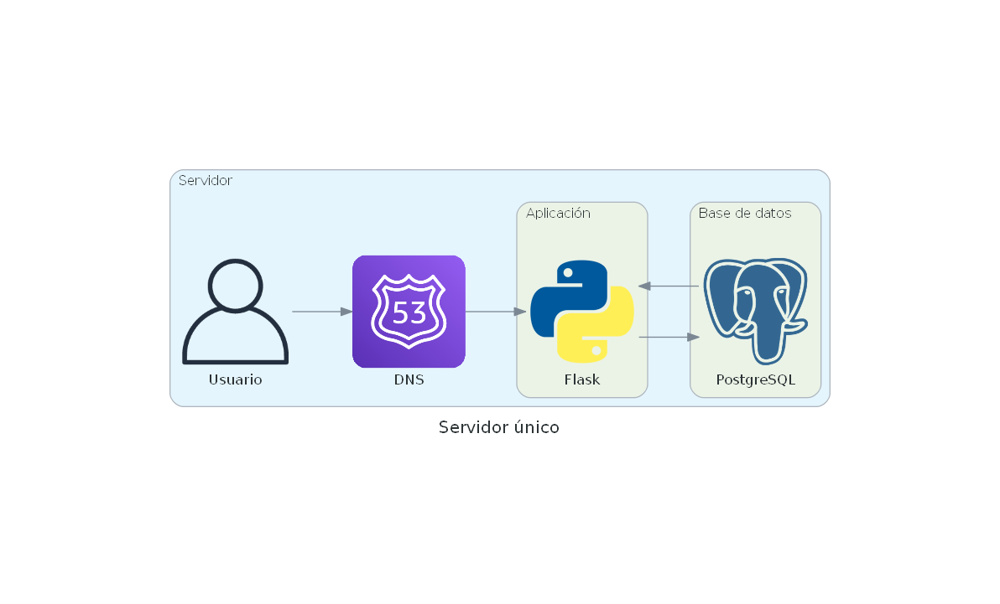
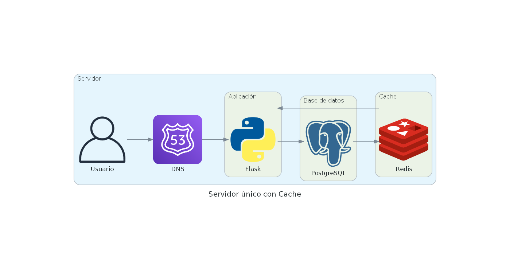

# Escalando un sistema a millones de usuarios

Para poder escalar un sistema a millones de usuarios, se requiere una planificación y estrategia en términos de 
- diseño, 
- arquitectura, 
- tecnologías utilizadas, 
- procesos y 
- herramientas.

Algunos de los factores que consideraremos son:

1. Diseño de la arquitectura del sistema: La arquitectura debe ser diseñada teniendo en cuenta: 
    - la escalabilidad, 
    - la redundancia, 
    - la tolerancia a fallos y 
    - la distribución de cargas.

2. Cuidar la selección de tecnologías escalables: La elección de tecnologías escalables y distribuidas es crítica para la escalabilidad del sistema.

3. Diseño de bases de datos escalables: Las bases de datos deben diseñarse de manera que puedan manejar grandes volúmenes de datos y tráfico simultáneo.

4. Implementación de caching: La implementación de una capa de caching puede mejorar significativamente el rendimiento del sistema.

5. Implementación de load balancing: La implementación de técnicas de balanceo de carga puede distribuir la carga de trabajo en diferentes servidores.

6. Implementación de técnicas de monitoreo y resolución de problemas: La implementación de técnicas de monitoreo y resolución de problemas puede ayudar a detectar y solucionar problemas antes de que afecten al usuario final.


## Sistema con un único servidor

Una de las implementaciones más simples de un servidor web podría ser la siguiente donde contamos con:
- DNS
- Servidor implementado en Flask
- Base de Datos

Aqui un usuario ineractua con una aplicación web que se ejecuta en un servidor. El DNS se utiliza para redirigir el tráfico de internet al servidor. El servidor ejecuta la aplicación web, la base de datos. Todo el tráfico entre estos componentes se produce dentro del servidor.



Esta clase de sistemas solo soporta unas pocas decenas de usuarios concurrentes.


Una optimización sencilla que ayuda a muchos sistemas que regresan el mismo valor es el agregar un sistema de cache:




Supongamos que tenemos una aplicación Flask simple que tarda 5 segundos en generar una respuesta. Si tenemos muchos usuarios accediendo a nuestra aplicación al mismo tiempo, esto puede causar una carga significativa en el servidor.

Sin embargo, podemos usar Flask-Caching para agregar una capa de cache a nuestra aplicación. Esto significa que, en lugar de generar la respuesta cada vez que se recibe una solicitud, podemos almacenar la respuesta en caché y enviar la respuesta almacenada en caché para solicitudes posteriores idénticas.

Aquí están los ejemplos de código sin y con cache:
```python
from flask import Flask
import time

app = Flask(__name__)

@app.route('/')
def hello_world():
    time.sleep(5) # simulando una respuesta lenta
    return '¡Hola mundo!'

if __name__ == '__main__':
    app.run(debug=True, host='0.0.0.0', port=5001)
```
mismo código pero haciendo uso de la cache:
```python
from flask import Flask
from flask_caching import Cache
import time

app = Flask(__name__)
cache = Cache(app, config={'CACHE_TYPE': 'simple'})

@app.route('/')
@cache.cached(timeout=300) # tiempo de caché en segundos
def hello_world():
    time.sleep(5) # simulando una respuesta lenta
    return '¡Hola mundo!'

if __name__ == '__main__':
    app.run(debug=True, host='0.0.0.0', port=5000)
```

En este ejemplo, estamos usando Flask-Caching para agregar una capa de cache a nuestra aplicación. El decorador cache.cached nos permite especificar el tiempo de almacenamiento en caché (en segundos) para la respuesta de esta ruta.

Si accedemos a nuestra aplicación varias veces, notaremos que la primera solicitud tardará 5 segundos, ya que la respuesta no se almacenó en caché. Sin embargo, las solicitudes posteriores serán mucho más rápidas, ya que la respuesta se recuperará de la caché en lugar de generarla nuevamente.

Este es solo un ejemplo simple, pero en aplicaciones más grandes y complejas, el uso de la caché puede mejorar significativamente la velocidad y la eficiencia del servidor.

Para testear el ejemplo abre una terminal en 
- [monorepo/00_scaling/flask-example/](monorepo/00_scaling/flask-example/) 
- [monorepo/00_scaling/flask-cache-example/](monorepo/00_scaling/flask-cache-example/) 

y compila el dockerfile

```bash
docker build -t docker/flask-example:latest .
docker build -t docker/flask-cache-example:latest .
```
Ahora habilitaremos ambos servidores:
```bash
docker run -p 5001:5001 --rm --name flask-example docker/flask-example:latest
docker run -p 5000:5000 --rm --name flask-cache-example docker/flask-cache-example:latest
```

ahora hagamos una prueba de carga con [link](./../../monorepo/00_scaling/test/flask-example/test_de_carga.py)

obtenemos la siguiente salida:


Sin usar Cache:
```bash
Test on url: http://localhost:5001/
Total time: 100.52343368530273 seconds
Requests per second: 0.994792918764182
```
Usando Cache:
```bash
Test on url: http://localhost:5000/
Total time: 1.0123414993286133 seconds
Requests per second: 98.78089564274524
```


