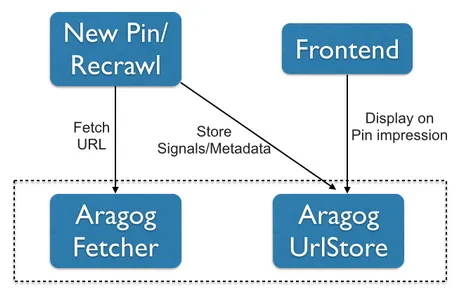
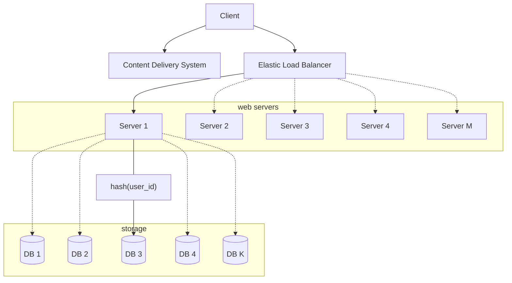
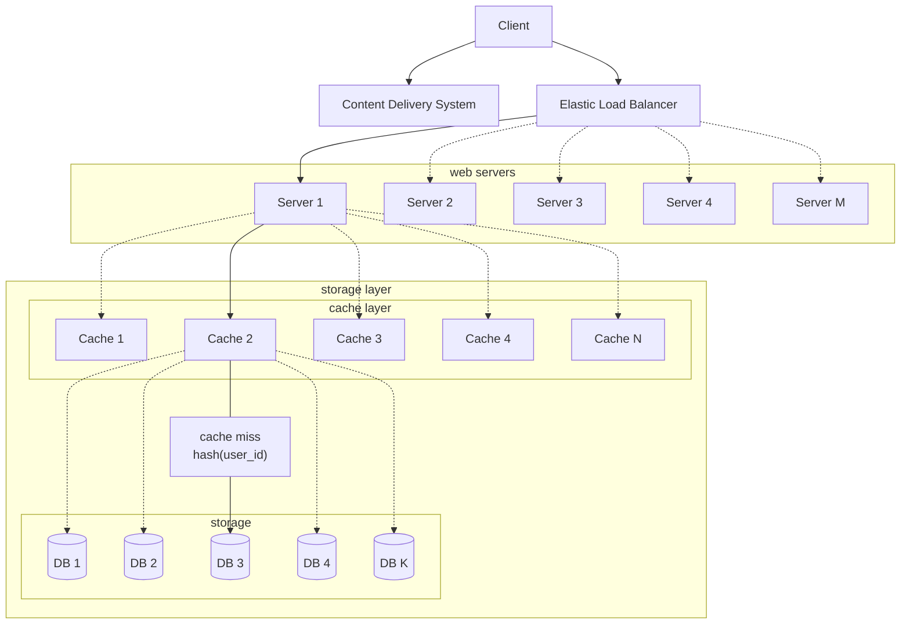
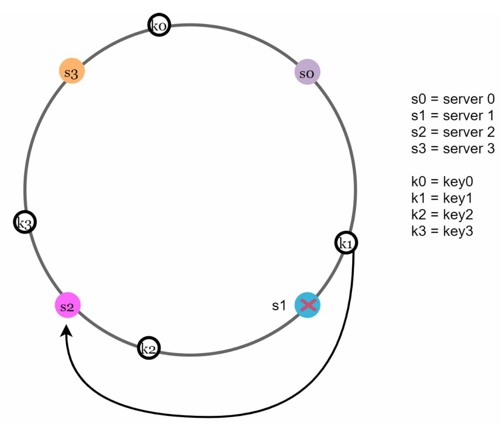
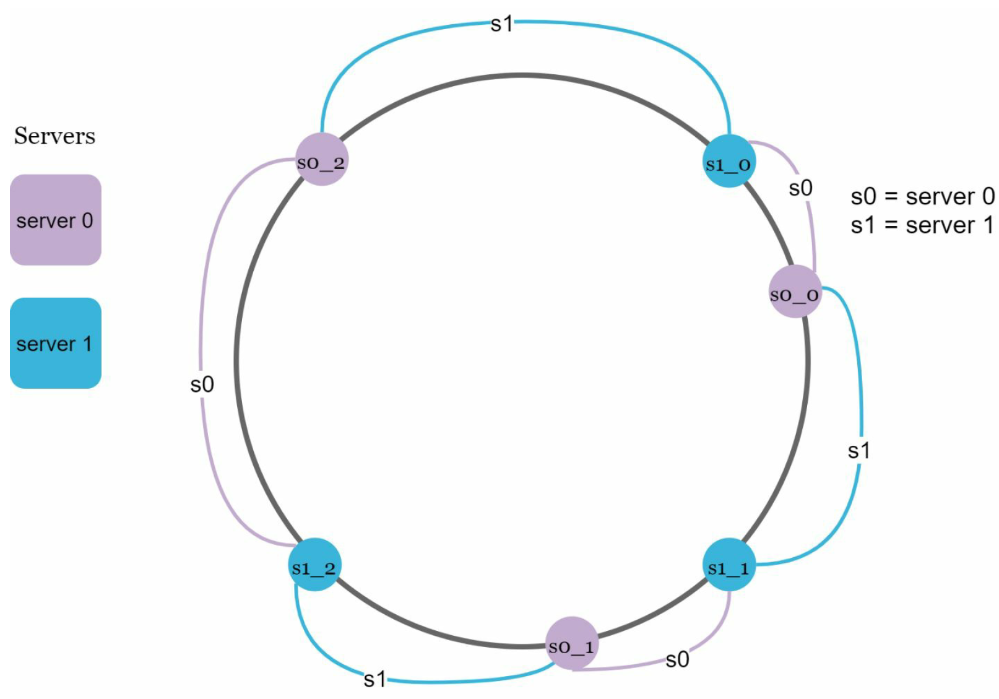

# Storage y Arquitectura de Caching 

Veamos el ejemplo de [Aragog architecture](https://medium.com/pinterest-engineering/fetching-and-serving-billions-of-urls-with-aragog-890a872585b5)

Este ejemplo nos servirá para dejar claro como funcionan los rate limits y el hashing consistente.

En el caso de Pinterest se tiene que tomar en cuenta que manejan billones de URLs, para poder manejar esa cantidad de URLs destacan los siguientes puntos:

- Normalization/canonicalization: La misma URL puede ser representada en distintas formas, por lo cual una gran cantidad de URLs deberán ser redirigidas a la misma URL. El proceso de normalización juega un papel preponderante en la reducción de data storage.
- Crawl politeness:  En esta escala es importante un rate limit asi como suavizar el trafico que se generé hacia dominios particulares. Además deberán respetarse las reglas establecidas en robots.txt.
- Modeling URL data: Una posibilidad es guardar metadata asociada a las URLs, asi como guardar y actualizar inlinks y outlinks asociadas a cada URL.

Aragog esta compuesto de dos servicios:
- Aragog fetcher: se encarga de buscar y retraer  sitios web, respetando de manera apropiada rate limits y canonicalizing URLs.
- Aragog UrlStore: guarda y sirve la metadata preprocesada asi como las señales.

En la siguiente imagen vemos dicha interacción descrita:

Aquí Aragog Fetcher es un servicio hecho con Thrift responsable de buscar y extraer las URLs. Aragog Fetcher se encarga de emitir los HTTP requests, seguir redireccionamientos y retraer el contenido y los HTTP headers. El fetcher regresa una estructura de Thrift la cual encapsula el contenido de la página, HTTP headers, latencia, cadenas de redirección y otros datos.

## Diseño de Hashing consistente

Uno de los objetivos más importantes del escalamiento horizontal es lograr distribuir la data y por supuesto los request a la data de manera eficiente entre los servidores de nuestro sistema. Para lograr esto utilizamos la técnica llamada **hashing consistente**.

## El problema del re-hashing

La información de los usuarios se guarda en servidores para storage usando el ID del usuario. Cada vez que accedemos a nuestra información una función hash es usada para encontrar el correspondiente shard.

En nuestro ejemplo seria algo asi como `user_id%K` en este shard o replica set es donde guardamos o hacemos request de la data del usuario.

Sin embargo, el proceso de ir hasta la base de datos es bastante costoso y un tanto complejo de mantener, por lo cual siempre tratamos de que la información se encuentre en la Cache. Aquí es donde introducimos una nueva capa, la capa de la Cache.

### Capa de Cache

El almacenamiento en caché es una técnica que tiene como objetivo mejorar el rendimiento y la escalabilidad de un sistema. Almacena en caché los datos al copiar temporalmente los datos a los que se accede con frecuencia en almacenamiento rápido, que se encuentra cerca de la aplicación.

Si recordamos de nuestros cursos la memoria cache era aquella que se sitúa entre el CPU y la Memoria RAM para acelerar los procesos de lectura y procesamiento de información por parte del CPU. En el caso de sistemas distribuidos, es la capa, que se encuentra entre el servidor y nuestra capa de base de datos.

Las aplicaciones distribuidas normalmente implementan las siguientes estrategias al almacenar datos en caché:

- Usan una caché privado, donde los datos se guardan localmente en el equipo que ejecuta una instancia de una aplicación o servicio.
- Usan una caché compartida, que actúa como un origen común al que se puede acceder desde varios procesos y máquinas.

En otro momento veremos las ventajas y desventajas de cada uno.

Si tenemos `N` servidores para el sistema de cache, una manera usual de rebalancear la carga es usando el siguiente re-hash:

`server_index = hash(key)%N` 

, donde `N` es el tamaño del pool de servidores.

Hagamos el siguiente ejemplo con `N=4`

|key|hash(key)|hash(key)%4|
|---|---|---|
| key_0 | 109375282 | 2 |
| key_1 | 109375283 | 3 |
| key_2 | 109375284 | 0 |
| key_3 | 109375285 | 1 |
| key_4 | 109375286 | 2 |
| key_5 | 109375287 | 3 |
| ... | ... | ... |
| key_M | 423375282 | 2 |

Está técnica funciona muy bien mientras se mantenga constante el número de servidores.

## Problemas con cache inconsistente

El problema viene cuando agregamos o perdemos algún servidor. Ya que la formula de re-hashing se volverá o bien `hash(key)%(N+1)` o `hash(key)%(N-1)` provocando una gran cantidad de chace misses.

Si mantenemos la misma regla, asumiendo `N=3` tenemos:

|key|hash(key)|hash(key)%4|hash(key)%3| Status |
|---|---|---|---|---|
| key_0 | 109375282 | 2 | 1 | Cache Miss |
| key_1 | 109375283 | 3 | 2 | Cache Miss |
| key_2 | 109375284 | 0 | 0 | Cached |
| key_3 | 109375285 | 1 | 1 | Cached |
| key_4 | 109375286 | 2 | 2 | Cached |
| key_5 | 109375287 | 3 | 0 | Cache Miss |
| ... | ... | ... |  |  |
| key_M | 423375282 | 2 | 0 | Cache Miss |

Es fácil darnos cuenta que tendremos una gran cantidad de `Cache Miss`, es decir, que la cache marcara un error y tendrá que ir a actualizar los datos hasta la base de datos, lo cual estresará todo el sistema.

## Hash consistente

En ciencias de la computación, el hash consistente es un tipo especial de técnica hash tal que cuando se cambia el tamaño de una tabla hash, en promedio solo $\frac{n}{m}$ claves necesitan ser reasignadas, donde $n$ es el número de llaves y $m$ es el número de ranuras. 

## Hash space y hash ring

Supongamos que estamos usando una función de hash basada en SHA-1, como [SHA-1](https://en.wikipedia.org/wiki/SHA-1) va de $0$ a $2^{160}-1$, esto quiere decir que a cada una de nuestras llaves $X_{0}, X_{1}, \ldots X_{N}$ le corresponde un valor en el intervalo $ \left[0, 2^{160}-1 \right]$.

Si lo viéramos como un conjunto de slots(ranuras) en linea recta se verían como en la siguiente imagen:

Hash ring solo consiste en unir el inicio con el final, creando asi un conjunto circular(un anillo).

## Hash servers

Usando la misma función de hash, podemos mapear los servidores ya sea usando la IP o el nombre del servidor, sobre este anillo.

# Hash keys y server lookup

La función de hash para servidores no es la misma que se usa para los request.

para determinar cual server se encargará de guardar una llave (key) usamos el sentido de las manecillas del reloj desde la posición de la llave hasta que un servidor es encontrado.

Qué sucede cuando removemos o perdemos un servidor en este caso?

Cuando removemos un servidor perderemos unicamente una fracción de las llaves requeridas en la redistribución con hashing consistente.

En el ejemplo al remover el server 1 solo la llave uno es mapeada al server 2, pero el resto de las llaves no es afectada.

Tenemos dos problemas a resolver con está técnica, 
- crear un mapeo "uniforme" de servidores y llaves, NO queremos que estén demasiado desbalanceados sin embargo no podremos garantizar una distribución equitativa, ya que se podrán agregar o remover servidores.
- crear una función que dada una llave encuentre que servidor le toca.

## Nodos Virtuales

Para resolver estos problemas se utiliza una técnica llamada nodos virtuales.

Aquí se crea una lista de nodos, y cada servidor se encarga de un conjunto de ellos.

lo cual vuelve muy practica la reasignación y el rebalanceo.

