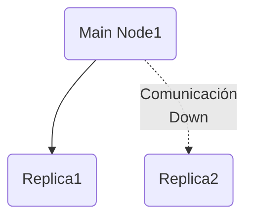
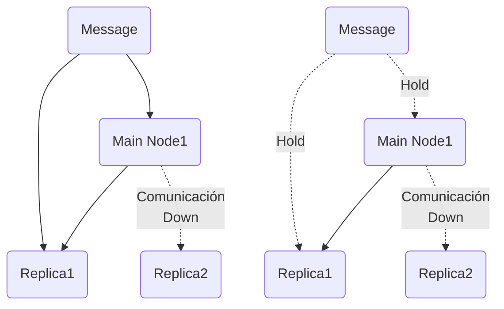
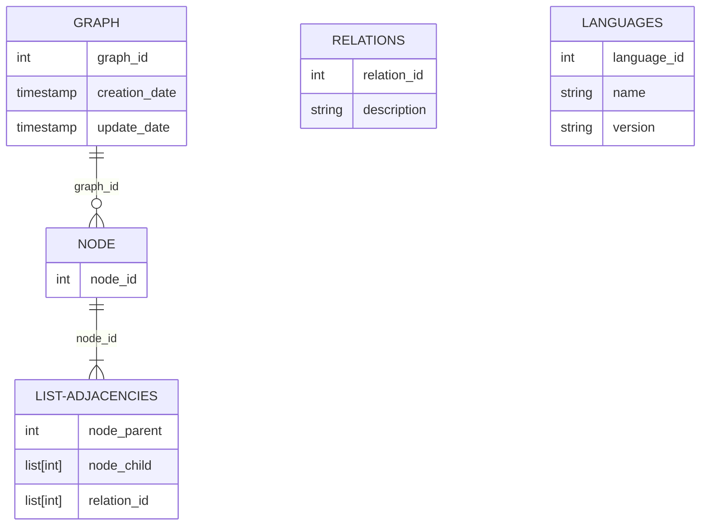

# Diseño de un Key Value Store

Un Key Value Store es una base de datos llave-valor, es decir, es una base de datos no relacional.

En una base de datos llave-valor, la llaves son únicas, y el valor solo puede ser accesado usando la llave. 

Las llaves pueden ser en texto plano o llaves hash. Aquí el valor puede ser cualquier cosa, ejemplos de tales bases de datos son:
- Amazon dynamo
- Memcached
- Redis


Ahora diseñaremos una una base de datos llave-valor con las operaciones:
- `put(key, value)`
- `get(key)`


Entre los tradeoff tenemos:
- lecturas
- escrituras
- uso de memoria
- consistencia
- disponibilidad

Características que ofreceremos:
- Consideraremos un par llave-valor de a lo más 10KB
- Habilidad para guardar big data
- Alta disponibilidad
- Alta escalabilidad
- Escalamiento automático
- Consistencia tuneable
- Baja latencia

## Base de datos llave-valor en un solo servidor

Está será la version más sencilla, aquí trataremos de mantener todos los valores en memoria. Dos optimizaciones que podemos hacer para incrementar la capacidad son:
- Compresión de datos
- Guardar en memoria solo información que es utilizada frecuentemente y el resto es guardada en disco.

## Base de datos llave-valor distribuida

Una base de datos llave-valor distribuida también se le conoce como  una tabla hash distribuida, cuyos pares son distribuidos a traves de muchos servidores.

### Teorema CAP

El teorema CAP establece que es imposible para un sistema distribuido garantizar más de dos de las siguiente propiedades:
- Consistencia: significa que todos los clientes ven la misma información todo el tiempo sin importar a que nodo se conectan.
- Disponibilidad: significa que cualquier cliente puede obtener la información que requiere independientemente de que algunos nodos estén caídos.
- Tolerancia a particiones: una partición indica que ocurrió un bloqueo de comunicación entre dos nodos. Tolerancia a particiones indica que el sistema continua operando a pesar de particiones en la red.

En el caso ideal "NO tendríamos particiones de red", la información que se escribe en un servidor `n1` es automáticamente replicada en los servidores `n2` y `n3`.
En ese caso tanto consistencia como disponibilidad estarían garantizadas por nuestro sistema.

En los casos reales es muy común que perdemos un servidor de nuestro pool como en el siguiente ejemplo:



aquí es donde hacemos la primer decisión `Main Node1` permitirá que se escriba en el y en `Replica1` o esperarán a que `Replica2` vuelva, aquí tenemos el problema de consistencia vs disponibilidad, la pregunta es definir la tolerancia/umbrales que manejaremos en cada uno, y como resolveremos las inconsistencias o problemas de disponibilidad.




### Componentes de nuestro sistema


- Data partition
- Data replication
- Consistency
- Inconsistency resolution
- Handling failures
- System architecture diagram
- Write path
- Read path

### Partición de los datos

Partición de los datos o sharding es muy común en sistemas grandes donde no podemos almacenar toda la información en un solo servidor.


Dos de los principales problemas a resolver durante la partición de datos son:
- Una distribución de carga balanceada entre multiples servidores.
- Minimizar el movimiento de datos cuando nodos son agregados o removidos.

Para lograr esto utilizaremos la técnica de hashing consistente, con la ventas:
- Escalado automático: los servidores pueden ser agregados o removimos dependiendo de la carga.
- Heterogeneidad: el número de nodos virtuales para un servidor es proporcional a la capacidad de carga.

## Replicación de los datos

Para lograr alta disponibilidad y fiabilidad(reliability), la información debe ser replicada de manera asíncrona sobre los `N` servidores.
Después de mapear una llave en una posición sobre un hash ring, caminamos en sentido de las manecillas del reloj, y escogemos los primeros `N` servidores sobre el anillo para guardar las copias de la información. Esto debe realizarse sobre nodos reales y no virtuales!


## Crearemos un docker con los siguientes elementos

- `N`: número de servidores para nuestra base de datos
- `W`: número de servidores para el quorum, es el número de copias que deben estar de acuerdo para considerar que una escritura ha sido exitosa.
- `R`: número de servidores para considerar una lectura como exitosa.

- Si `W+R > N`, tenemos consistencia fuerte, usualmente `N=3`, `W=R=2`.
- `R = 1` y `W = N` significa que el sistema esta optimizado para lectura.
- `W = 1` y `R = N` significa que el sistema esta optimizado para escritura.
- Escoger lenguaje para implementar
    - python
    - cpp
    - java
- Escoger librería para el manejo de eventos asíncronos
    - python:
        - gevent
        - greenlets
        - twisted
- Escoger OS
    - Ubuntu 20.04
    - Alpine
- Escoger engine para guardar datos en cada nodo
    - csv, json
    - SQLlite
    - MySQL
    - LMDB
    - Mongo
- Crear un watcher
    - Revisara el estado al engine
- Crear/diseñar un heartbeat
    - Definir tiempo y mecanismos de reinicio


### Ejemplo de una aplicación

Vamos a diseñar una base de datos llave valor que nos permita guardar todos los grafos de llamadas y relaciones en el código de un sistema o varios sistemas, como estos datos pueden ser consultados por distintos usuarios en distintas, además de permitir a los usuarios actualizar dicha base de datos en tiempo real.

En general un grafo esta constituido de nodos y una matriz de adyancencias.

queremos guardar la siguiente información:

- ID del grafo
- ID del nodo
    - Tipo de elemento
        - Variable
        - Función
        - Clase
- Lista de adyancencias de cada nodo junto con el tipo de relación:
    - Variables
        - Objeto que la lee
        - Objeto que la escribe
        - Objeto que copia su valor o guarda una referencia.
    - Relaciones de función:
        - Función que llama
        - Función que es llamada
    - Relaciones de clase:
        ```mermaid
            classDiagram
            classA --|> classB : Inheritance
            classC --* classD : Composition
            classE --o classF : Aggregation
            classG --> classH : Association
            classI -- classJ : Link(Solid)
            classK ..> classL : Dependency
            classM ..|> classN : Realization
            classO .. classP : Link(Dashed)
        ```
- Archivos parseados de donde se genero el grafo de relaciones
    - Nombre del archivo
    - Path relativo
    - Checksum 
        - MD5
        - [Adler-32](https://en.wikipedia.org/wiki/Adler-32)
- Fecha de creación
- Fecha de última actualización





