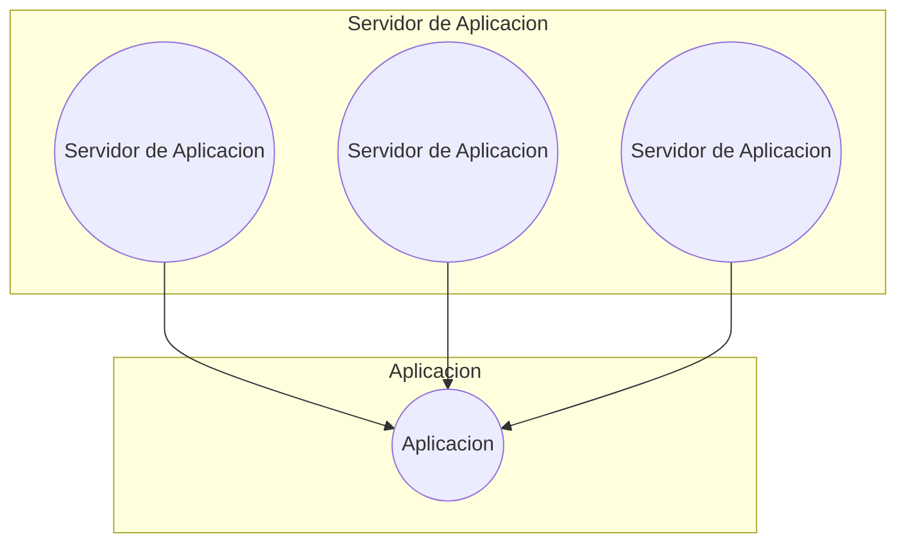
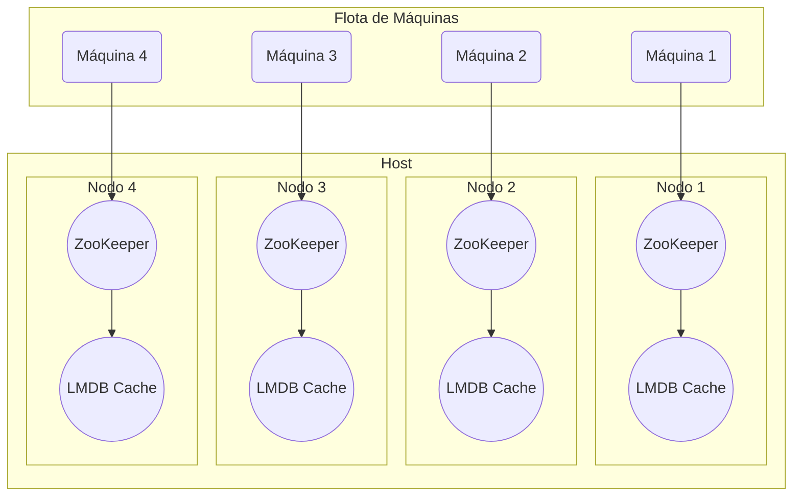
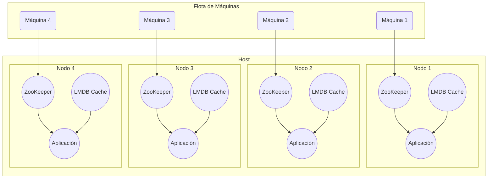

# Cache memory

```mermaid
graph TD

subgraph Aplicacion
    A((Aplicacion))
end

subgraph Servidor de Aplicacion
    B((Servidor de Aplicacion)) --> A
    C((Servidor de Aplicacion)) --> A
    D((Servidor de Aplicacion)) --> A
end


```
subgraph Redis(Cache)
    R(Redis)
end

subgraph Base de Datos
    DB(Base de Datos)
end

A --> R
R --> B
R --> C
R --> D
DB --> A
DB --> R

```mermaid
graph TD

subgraph Flota de Máquinas
    A(Máquina 1)
    B(Máquina 2)
    C(Máquina 3)
    D(Máquina 4)
end

subgraph Host
    subgraph Nodo 1
        A --> N1_ZooKeeper((ZooKeeper))
        N1_ZooKeeper --> N1_Cache((LMDB Cache))
    end

    subgraph Nodo 2
        B --> N2_ZooKeeper((ZooKeeper))
        N2_ZooKeeper --> N2_Cache((LMDB Cache))
    end

    subgraph Nodo 3
        C --> N3_ZooKeeper((ZooKeeper))
        N3_ZooKeeper --> N3_Cache((LMDB Cache))
    end

    subgraph Nodo 4
        D --> N4_ZooKeeper((ZooKeeper))
        N4_ZooKeeper --> N4_Cache((LMDB Cache))
    end
end


```

## Zookeper actualiza

```mermaid
graph TD

subgraph Flota de Máquinas
    A(Máquina 1)
    B(Máquina 2)
    C(Máquina 3)
    D(Máquina 4)
end

subgraph Host
    subgraph Nodo 1
        A --> N1_ZooKeeper((ZooKeeper))
        N1_ZooKeeper --> N1_Cache((LMDB Cache))
    end

    subgraph Nodo 2
        B --> N2_ZooKeeper((ZooKeeper))
        N2_ZooKeeper --> N2_Cache((LMDB Cache))
    end

    subgraph Nodo 3
        C --> N3_ZooKeeper((ZooKeeper))
        N3_ZooKeeper --> N3_Cache((LMDB Cache))
    end

    subgraph Nodo 4
        D --> N4_ZooKeeper((ZooKeeper))
        N4_ZooKeeper --> N4_Cache((LMDB Cache))
    end
end


```

## Sidecar

```mermaid
graph TD

subgraph Flota de Máquinas
    A(Máquina 1)
    B(Máquina 2)
    C(Máquina 3)
    D(Máquina 4)
end

subgraph Host
    subgraph Nodo 1
        A --> N1_ZooKeeper((ZooKeeper))
        N1_ZooKeeper --> N1_App((Aplicación))
        N1_Cache((LMDB Cache)) --> N1_App
    end

    subgraph Nodo 2
        B --> N2_ZooKeeper((ZooKeeper))
        N2_ZooKeeper --> N2_App((Aplicación))
        N2_Cache((LMDB Cache)) --> N2_App
    end

    subgraph Nodo 3
        C --> N3_ZooKeeper((ZooKeeper))
        N3_ZooKeeper --> N3_App((Aplicación))
        N3_Cache((LMDB Cache)) --> N3_App
    end

    subgraph Nodo 4
        D --> N4_ZooKeeper((ZooKeeper))
        N4_ZooKeeper --> N4_App((Aplicación))
        N4_Cache((LMDB Cache)) --> N4_App
    end
end


```