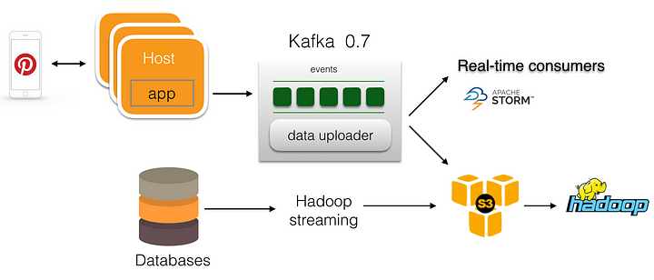
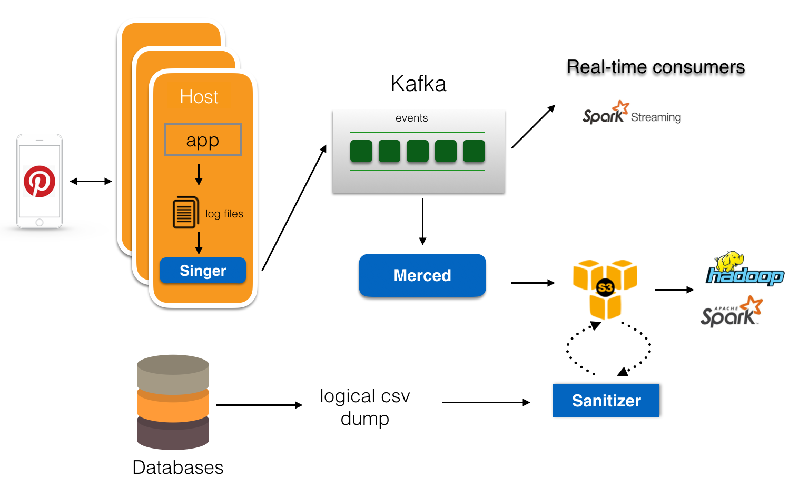

# Scalable and reliable data ingestion at Pinterest

From [blog pinterest-engineering](https://medium.com/pinterest-engineering/scalable-and-reliable-data-ingestion-at-pinterest-b921c2ee8754)

En Pinterest, se utilizan los datos para obtener información que permita tomar decisiones y mejorar la experiencia de los usuarios, que en Pinterest son llamadas pinners. Cada día registran más de 100 terabytes de datos!. 

Para utilizar los datos de forma eficaz, primero se deben ingerir de forma fiable y se preparan cuidadosamente para su posterior uso.

La ingesta de datos consiste en recopilar datos de diversas fuentes y trasladarlos a un almacenamiento persistente. Los datos normalmente se distribuyen en decenas de miles de hosts en varios formatos, por lo que hacerlo de una manera confiable, eficiente y escalable es una tarea desafiante.

La ingesta de datos generalmente tiene los siguientes requisitos:

- **Fiabilidad**: la recopilación y el transporte de datos deben ser fiables y con una pérdida mínima de datos.
- **Rendimiento**: los pipelines deben tener un alto rendimiento y una baja latencia.
- **Eficiencia**: debe minimizarse el uso recursos de computación y almacenamiento.
- **Flexibilidad**: debe admitir varias fuentes y formatos de datos.
- **Autónomo**: el sistema debe funcionar con una sobrecarga operativa mínima

En Pinterest, existen dos categorías principales de conjuntos de datos: 
- registros(logging) de servicios en línea y 
- volcados(dumps) de bases de datos. 

Los registros(logs) de servicios son flujos de registros continuos generados por servicios en miles de hosts. 

Los pipelines que recopilan los logs de servicios generalmente constan de tres etapas: 
- recopilación/extracción de registros(logs), 
- transporte de registros(logs) y 
- persistencia de registros(logs). 

Los volcados(dumps) de bases de datos son copias de seguridad lógicas de bases de datos y se generan cada hora o diariamente. La ingesta de bases de datos a menudo incluye la generación de volcados(dumps) de bases de datos y el posprocesamiento.

La Figura muestra los pipelines de ingesta en 2014. En ese momento, se utilizaba Kafka como transportador central de mensajes en el lado del servicio en línea. 
1. Los servidores de aplicaciones enviaban mensajes de registro(logs) directamente a Kafka. 
2. Un cargador de datos en cada corredor(broker) de Kafka cargaba los archivos de registro(logs) de Kafka en S3. 
3. En el lado del volcado(dump) de la base de datos, se contaba con un trabajo de transmisión personalizado (customized streaming job) de Hadoop para extraer los datos de la base de datos y escribir los resultados en S3. 

Sin embargo, hubo algunos problemas con esta configuración:

- Al escribir directamente desde el servidor de aplicaciones a Kafka, si los brokers de Kafka sufrían una interrupción, los mensajes debían almacenarse en la memoria del lado del servidor. Como el tamaño del búfer es limitado, una interrupción prolongada de Kafka provoca la pérdida de datos.
- No hubo replicación en Kafka 0.7. La falla del broker de Kafka causaba la pérdida de datos.
- Para minimizar el impacto de los servicios en línea, solo podemos realizar volcados(dumps) de bases de datos de nodos esclavos.
- Necesitamos realizar un seguimiento del mapeo maestro-esclavo, y la conmutación por error frecuente de volcados de bases de datos puede aumentar el fracaso de estos trabajos.
- Los gastos generales de operación eran elevados.

Para abordar estos problemas, se mejoraron varias etapas de la ingesta de datos. La figura con la ingesta de datos de 2016 muestra la arquitectura actualizada donde se realizaron los siguientes cambios en los pipelines de ingesta de datos:

- Para el registro(logging) de servicios en línea, en lugar de escribir directamente en Kafka, los servicios escriben mensajes de registro(logs) en el disco local.
- Se creo un agente de registro(logs) de alto rendimiento llamado **Singer** que carga mensajes de registro(de los logs) desde los hosts a Kafka. Singer admite múltiples formatos de registro(logs) y garantiza la entrega al menos una vez de los mensajes de registro(logs).
- Se desarrollo [**Secor**](https://github.com/pinterest/secor) y se creo un servicio de persistencia de datos llamado **Merced** para mover datos de Kafka a S3. Merced utiliza un consumidor de bajo nivel para leer mensajes de Kafka y emplea un enfoque de trabajador maestro para distribuir cargas de trabajo persistentes de datos entre los trabajadores(Workers). Merced garantiza la persistencia de mensajes exactamente una vez desde Kafka a S3.
- Se agregó una etapa de desinfección al proceso para tareas de sanitización de datos, por ejemplo:
    - verificación de cumplimiento de esquemas, 
    - deduplicación, 
    - cumplimiento de políticas de datos y más.
- En el lado de la ingesta de bases de datos, en lugar de usar una secuencia de Hadoop para extraer datos de la base de datos, las bases de datos almacenan directamente el volcado(dump) lógico en S3 y usan el framework de sanitización para generar los conjuntos de datos necesarios para el procesamiento posterior.
- Se crearon auditorías de extremo a extremo y verificación de la integridad de los datos, y se mejoro la visibilidad en cada etapa del proceso para reducir los gastos generales de operación.

Con esta configuración, han podido manejar más de 150 mil millones de mensajes por día y más de 50 TB de volcado(dumps) de base de datos lógicas. Con una base de usuarios en crecimiento de 175 millones de personas cada mes y un gráfico en constante expansión de 100 mil millones de Pines, se enfrentan a nuevos desafíos:

- La generación de volcados(dumps) de CSV lógicos a menudo se retrasa debido a la conmutación por error de los maestros de la base de datos. Esto evita que el flujo descendente obtenga datos nuevos a tiempo. Se necesitan ingerir datos de la base de datos de forma incremental para mejorar la confiabilidad y el rendimiento de la ingestión de la base de datos.
- Es necesario simplificar aún más la creación y la incorporación de pipelines de datos.
- La operación de Kafka se convierte en un desafío cuando se amplían los clústeres de Kafka.
- Es posible que más eventos lleguen tarde por varias razones; se deben manejar los eventos que llegan tarde de manera consistente.

