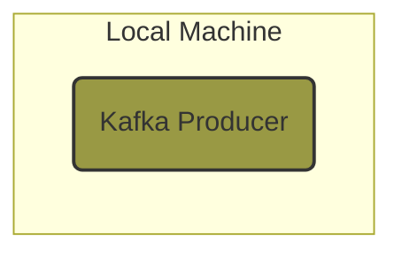
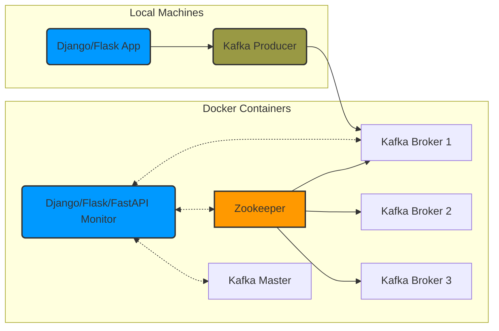
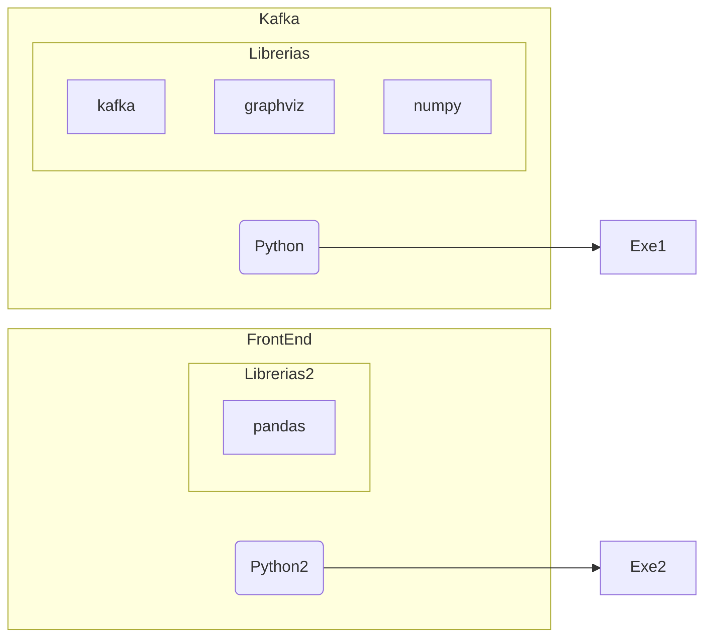

# Proyecto Base Datos Llave Valor

Para empezar a trabajar hemos creado un proyecto de django corriendo la instrucción:

`docker-compose run django django-admin startproject dataingest .`

Una vez creado abrimos el proyecto de django `dataingest/settings.py` y agregamos las siguientes líneas después de `import os`

Django App es la aplicación local de Django que esatará enviando los "datos" es decir será nuestro "Kafka Producer". 

Por el momento funcionará como una aplicación externa, sin embargo eventualmente se convertirá en un sidecar de cada una de nuestras aplicaciones.

